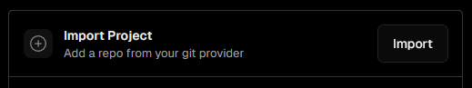
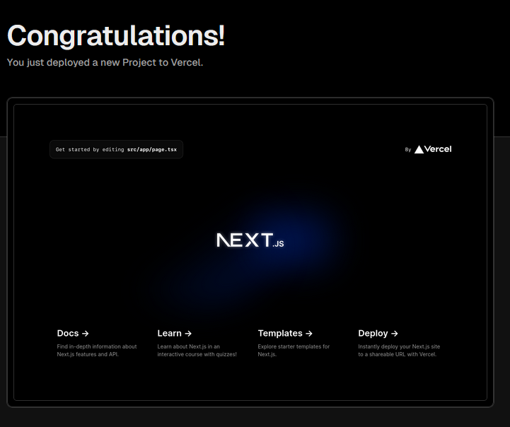

# Hackathon: Deploying to Vercel

## Part 1: Deploying
1. Run `npx create-next-app@latest` in the terminal.
2. Select the default for all CLI prompts.
3. Go to GitHub and create a new repository.
4. Enter the folder that was created in **step 1** and run these commands to publish.
```
git init
git add .
git commit -m "first commit"
git branch -M main
git remote add origin <your_repo_url>
git push -u origin main
```
5. [Create a Vercel Account](https://vercel.com/signup). Use **GitHub** and select **Hobby**.
6. Click on Import Project.
   


7. Click on Import on your project.
    


8. Leave all config on default and click **Deploy**.
9. Click on the preview of your site to go the your deployed site.
    


## Part 2: Branch Previews
1. Go back to the terminal inside the project folder.
2. Create a new branch.
```
git checkout -b my-new-branch
```
3. Make any change to the file `app\page.tsx` so that we can see the difference once it's deployed.
4. Commit and push.
```
git add .
git commit -m "changed page.tsx"
git push -u origin HEAD
```
5. Go back to Vercel and scroll down on the **Project** tab. There you should see your branch deployed as a preview.
